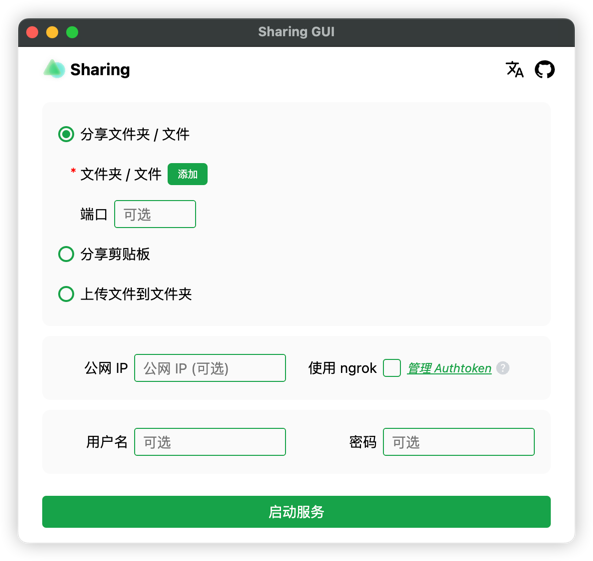
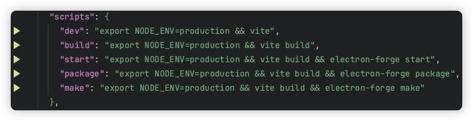

# forked from imyuanx/sharing-GUI
我根据自己的需求，做了个性化开发，增减部分功能。

# Sharing GUI


Sharing GUI 是一个客户端，用于跨多个设备（iOS、Android、macOS、Windows、Linux…）共享文件

**只需要一个客户端**, 其他设备使用 WEB。（客户端支持 macOS，即将支持 Windows、Linux）

## 下载

可以从[GitHub Releases](https://github.com/LIAO153/sharing-GUI/releases)下载安装，当然你也可以克隆代码自己打包（见下文）

## 特性

- 在其他设备上下载你的文件
- 接收其他设备上的文件
- 在其他设备上访问剪贴板
- 支持局域网、公网
- 支持身份认证
- 支持 [ngrok](https://ngrok.com/)，快速分享到公网

## 提示

- 支持同时共享多个目录还支持文件夹和文件的组合。
- 可以拖放目录或文件到软件。

## 预览



## 开发
### 安装项目的所有依赖
```bash
    yarn install
```
### 运行
```bash
      yarn + "scripts"  # 比如：yarn dev
```

